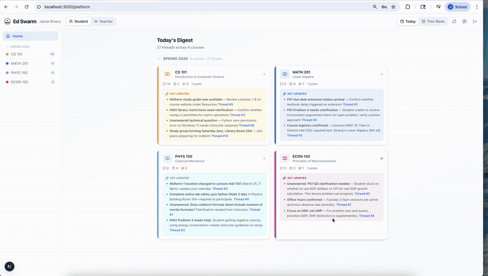
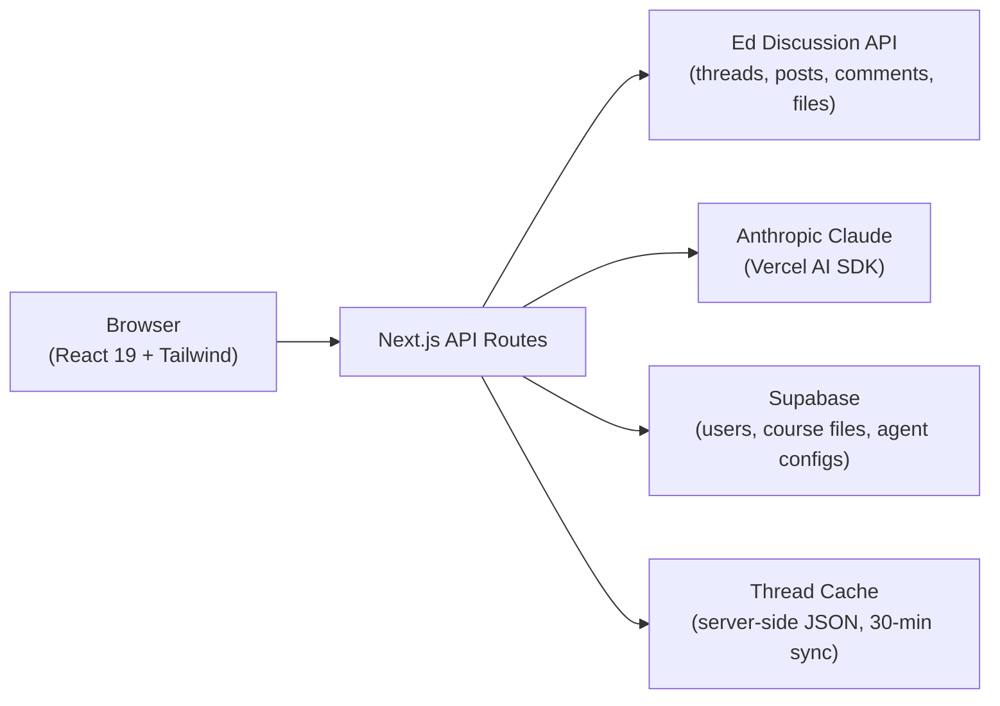

<div align="center">


# EdSwarm

**AI swarm intelligence for your Ed Discussion courses.**

Digests every thread, answers questions with course context, catches duplicates before they're posted, and lets course staff approve AI-drafted answers at scale — all on top of the Ed Discussion forum you already use.

[](https://nextjs.org)
[](https://react.dev)
[](https://www.typescriptlang.org)
[](https://tailwindcss.com)
[-D97757?logo=anthropic&logoColor=white)](https://www.anthropic.com)
[](https://supabase.com)

</div>

---

## Demo

<div align="center">



*Sped-up preview — watch the [full demo video](docs/demo.mp4) at real speed.*

</div>

---

## The Problem

Ed Discussion forums get noisy fast. Students drown in threads and miss the announcements that matter. Course staff answer the same question five times a week. EdSwarm puts an AI layer on top of Ed that works for both sides:

- **Students** get a digest of what actually matters across all their courses, plus an AI assistant grounded in real thread and course-material context.
- **Instructors & TAs** get an agent that drafts answers to pending questions in bulk — with a human-in-the-loop review step before anything is posted.

---

## Features

### For Students

| Feature | What it does |
|---|---|
| **AI Course Digests** | A "Today's Digest" across every enrolled course, with AI-generated *Key Updates* that link directly to the relevant threads. Filter by today or this week. |
| **Context-Aware Chat** | A slide-out AI assistant scoped to one course (or all of them), grounded in up to 100 cached threads per course plus uploaded course materials. Streaming responses with KaTeX math rendering. |
| **Duplicate Detection** | Before a question is posted, an agent searches existing threads with search + thread-inspection tools and flags `exact duplicate` / `likely answered` / `related` matches — so the forum stays clean. |
| **Smart Post Composer** | Rich-text editor that converts to Ed's XML format, with AI-drafted titles and bodies, category picker, image uploads, and private/anonymous toggles. |
| **Thread Browser** | Expand full threads with replies, draft AI-assisted responses, and post back to Ed without leaving the app. |

### For Instructors & TAs

| Feature | What it does |
|---|---|
| **Configurable AI Agent** | Per-course agent instructions (custom system prompt), category filters, and context file uploads. |
| **Course Materials (lightweight RAG)** | Upload syllabi, notes, and handouts (`.txt`, `.md`, `.pdf`, `.csv`, `.json`). Files get auto-summarized; small corpora are inlined into prompts, larger ones are retrieved on demand via a file-content tool. |
| **Batch Answer Generation** | One click fetches all unanswered questions and generates draft answers for each — citing uploaded course files where relevant. |
| **Human-in-the-Loop Review** | Approve, edit, or dismiss each draft in a review panel, then post to Ed individually or in bulk. Nothing is published without sign-off. |

### Try It Without a Token

EdSwarm ships with a full **demo mode** — five seeded courses, realistic threads, a mock user, and localStorage persistence. Every feature (digests, chat, duplicate detection, the teacher agent workflow) works without an Ed account or API token.

---

## How It Works



1. **Connect** — paste an Ed API token (or hit *Try Demo*). The token is validated against Ed and the user is upserted into Supabase.
2. **Sync** — threads are paginated from Ed, stripped to plain text, and cached server-side. The cache powers chat context, digests, and duplicate search without hammering Ed's API.
3. **Generate** — summaries, draft answers, and duplicate checks run through Claude, with Anthropic prompt caching to keep latency and cost down.
4. **Post** — approved content flows back to Ed through proxied API routes (`/api/ed/*`) using the user's own bearer token.

### AI Model Strategy

The right model for each job — fast and cheap where possible, strong where it counts:

| Task | Model | Why |
|---|---|---|
| Course digests & file summaries | `claude-haiku-4-5` | High-volume, low-latency summarization |
| Duplicate detection (agentic, with tools) | `claude-haiku-4-5` | Fast tool-use loop over cached threads |
| Student chat assistant | `claude-sonnet-4-6` | Quality reasoning over large thread context |
| Instructor answer drafts | `claude-sonnet-4-6` | Accuracy matters when answers get posted |

---

## Tech Stack

- **Framework** — [Next.js 16](https://nextjs.org) (App Router) · React 19 · TypeScript
- **AI** — [Anthropic Claude](https://www.anthropic.com) via the [Vercel AI SDK](https://sdk.vercel.ai) (`ai`, `@ai-sdk/anthropic`, `@ai-sdk/react`) with streaming, tool use, and prompt caching
- **Database** — [Supabase](https://supabase.com) (Postgres) for users, course files, and agent configs
- **Styling** — Tailwind CSS 4 · Lucide icons · KaTeX for math rendering
- **Integration** — [Ed Discussion API](https://edstem.org) (threads, posts, comments, file uploads)

---

## Getting Started

### Prerequisites

- Node.js 20+
- An [Anthropic API key](https://console.anthropic.com)
- A [Supabase](https://supabase.com) project (only needed for live mode)

### Setup

```bash
git clone https://github.com/justinlxiang/EdSwarm.git
cd EdSwarm
npm install
```

Create a `.env.local` in the project root:

```bash
ANTHROPIC_API_KEY=sk-ant-...

# Required for live mode (Supabase persistence)
NEXT_PUBLIC_SUPABASE_URL=https://your-project.supabase.co
NEXT_PUBLIC_SUPABASE_ANON_KEY=...
SUPABASE_SERVICE_ROLE_KEY=...
```

Run it:

```bash
npm run dev
```

Open [http://localhost:3000](http://localhost:3000) and either:

- **Try Demo** — explore everything with seeded courses, no Ed account needed, or
- **Connect Ed** — paste an API token from [edstem.org → Settings → API Tokens](https://edstem.org/us/settings/api-tokens) to use your real courses.

---

## Project Structure

```
src/
├── app/
│   ├── page.tsx               # Marketing landing page
│   ├── platform/              # Main app (digest dashboard)
│   └── api/
│       ├── ed/                # Proxied Ed Discussion endpoints (threads, post, comment, upload, sync)
│       ├── chat/              # Streaming AI chat (Sonnet + file-content tool)
│       ├── summarize/         # Digests, post drafts, reply drafts (Haiku)
│       ├── agent/
│       │   ├── answer/        # Instructor batch answer generation (Sonnet)
│       │   └── check-duplicate/  # Agentic duplicate detection (Haiku + tools)
│       └── course-files/      # Course material upload, content, summaries
├── components/                # Digest view, chat panel, teacher dashboard, answer review, composer...
├── hooks/                     # useCourses, useCourseFiles, useAgentConfig
└── lib/                       # Ed API client, Supabase, thread cache, demo storage, file context
```

---

## Demo Mode vs. Live Mode

| | Demo | Live |
|---|---|---|
| Auth | One click, mock user | Ed API bearer token |
| Courses & threads | 5 seeded courses | Your real Ed enrollments |
| Posts & replies | Persisted in localStorage | Posted to Ed for real |
| Agent config & files | localStorage | Supabase |
| AI features | Fully functional | Fully functional |

---

<div align="center">

**EdSwarm** — AI Swarm Intelligence for Ed Discussion

</div>
